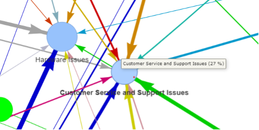
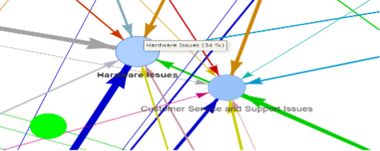
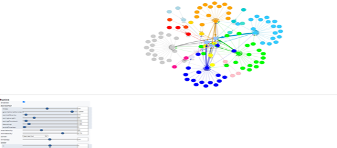
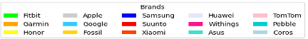

# Introduction

This visualization was developed using the Pyvis Python library. The data used in this visualization was collected from Twitter for wearable devices in the sports industry from January 2018 to March 2023.

## Table of Contents
- [Introduction](#introduction)
- [Data Source](#data-source)
- [Cluster Breakdown](#cluster-breakdown)

## Data Source

The data used for this visualization was collected from Twitter over a period spanning from January 2018 to March 2023. This dataset contains discussions, comments, and mentions related to sport products, specifically wearable devices, in the sports industry.

## Cluster Breakdown

### Table 1: Issues and Their Corresponding Keywords

| Cluster                   | Issues                                                                                                   |
|---------------------------|---------------------------------------------------------------------------------------------------------|
| Hardware Issues           | broken, malfunctioning, stopped working, not working, poor quality, not durable, not reliable, faulty, defective |
| User Experience Issues    | disappointed, frustrated, terrible, unreliable, difficult to use, not user-friendly                   |
| Pricing and Value Issues  | not worth, waste of money, overpriced, too expensive                                                  |
| Accuracy and Tracking Issues | not accurate, inaccurate, not accurate heart rate monitor, not accurate sleep tracker, not accurate step counter, not accurate calorie tracker, not accurate distance tracker, not accurate GPS |
| Customer Service and Support Issues | customer service, support, warranty, return policy                                          |
| Delivery and Packaging Issues | shipping, delivery, package not delivered, package lost, package damaged                               |

Table 1 provides a breakdown of different clusters and associated issues related to sport products, specifically wearable devices. By categorizing the issues into clusters, this table provides an organized overview of the common problems reported by users of sport products, specifically wearable devices.

## Visualization Network Description

The visualization network depicts relationships between nodes in the graph, with three types of nodes: Tweets, Brands, and Clusters of Issues. The edges connect these nodes to illustrate connections and associations:

- Edges connect tweet nodes to brand nodes when a tweet mentions a particular brand, representing the relationship between the tweet and the referenced brand.

- Edges also connect brand nodes to clusters of issues nodes, indicating associations between a brand and specific clusters of issues. This connection signifies the relationship between the brand and the relevant issues discussed in the graph.

Consider a sample graph visualization:

- Tweet 1 mentions Brand A, so there is an edge connecting Tweet 1 to Brand A.
- Tweet 2 mentions Brand B, so there is an edge connecting Tweet 2 to Brand B.
- Tweet 3 mentions both Brand A and Brand B, so there are edges connecting Tweet 3 to both Brand A and Brand B.

Additionally, assume the graph has three clusters of issues:

- Issue Cluster 1 represents hardware issues.
- Issue Cluster 2 represents user experience issues.
- Issue Cluster 3 represents pricing and value issues.

In this case:

- Brand A is connected to Issue Cluster 1 and Issue Cluster 2, indicating its association with both hardware and user experience issues.
- Brand B is connected to Issue Cluster 2 and Issue Cluster 3, implying its link to user experience and pricing/value issues.

There are no direct connections between the tweet nodes and the issue cluster nodes. Instead, relationships are established through connections between tweet nodes and brand nodes, as well as between brand nodes and issue cluster nodes.

By examining the edges in the graph, you can identify relationships between tweets, brands, and clusters of issues, helping understand which brands are mentioned in the tweets and the specific issue clusters associated with each brand. The size of each edge between a brand and an issue cluster represents the number of complaints received for the respective issue. Larger or thicker edges indicate a higher number of complaints, while smaller or thinner edges suggest fewer complaints.

The size of each edge between (brand and issue cluster) represents the number of complaints received for the respective issue. Specifically, larger or thicker edges indicate a higher number of complaints received for the respective issue cluster associated with a brand. Conversely, smaller or thinner edges suggest a lower number of complaints received.

The size of the issue cluster nodes is determined by the fraction of issues they have received. Specifically, larger issue cluster nodes indicate that they have received a higher proportion of the overall issues mentioned, while smaller issue cluster nodes represent a smaller fraction of the total issues.

For example, if Issue Cluster 1 has received a significant portion of the issues mentioned, the corresponding issue cluster node would be depicted as larger. Conversely, if Issue Cluster 2 has received a smaller fraction of the issues, the corresponding issue cluster node would be represented as smaller.

**Figure 1: Customer Service and Support Issues node with 27%**

This figure represents the issue cluster related to Customer Service and Support Issues. The node representing this issue cluster is depicted with a size that reflects it has received 27% of the total issues mentioned in the visualization. The larger size indicates that Customer Service and Support Issues are relatively prominent or have a significant proportion compared to other issue clusters.

**Figure 2: Example of Hardware Issues Node with 34%**

This figure displays the issue cluster related to Hardware Issues. The node representing this issue cluster is depicted with a size that corresponds to it having received 34% of the total issues mentioned. The larger size indicates that Hardware Issues hold a relatively significant proportion compared to other issue clusters in the graph.

By visually representing the size of each issue cluster node based on the fraction or percentage of issues it has received, Figures 1 and 2 provide a visual depiction of the relative importance or prevalence of these specific issue clusters.

## The Visualization Workspace

This section will talk about the implementation of the previous section. Figure 3 illustrates the visualization of the workspace with physics options provided by Pyvis that allow users to customize the interactions between nodes in the graph visualization. These physics options simulate physical forces like springs and other interactions between nodes, resulting in a more natural and visually appealing dynamics of the graph.

**Figure 3: Workspace of the Network Visualization**

By incorporating these physics options, the nodes in the graph can be positioned and moved in a way that simulates real-world physics. Nodes can attract or repel each other, creating a sense of balance and spacing within the visualization. Additionally, the physics options can introduce animations and smooth transitions when nodes are moved or rearranged, enhancing the visual experience.

This dynamic and interactive behavior of the graph, resembling physical interactions, not only makes the visualization aesthetically pleasing but also improves the overall user experience. Users can interactively explore and manipulate the graph, observing how nodes respond to different forces and interactions, which can lead to a better understanding and interpretation of the underlying data.

In this visualization, both tweet nodes and brand nodes are assigned the same color. The shared color represents a common attribute or characteristic between the two types of nodes, creating a visual association between tweets and the brands they mention as shown in Figure 4.

**Figure 4: Brands Nodes colors**

For example:

- Tweet nodes and brand nodes are both represented with a blue color.
- This shared blue color indicates that tweets and the corresponding brands are linked together in the visualization.
- By assigning the same color to both tweet nodes and brand nodes, the visualization emphasizes the connection and relationship between tweets and the brands they reference. This visual representation helps in identifying the association between specific tweets and the corresponding brands, enabling a better understanding of the interactions and discussions related to particular brands on the platform.

## Network Visualization Statistics

To address memory limitations, I have restricted the number of tweets per brand to ten. The table below presents the statistics of the tweet issues brands visualization network.

| Statistic                   |       |
|-----------------------------|-------|
| Number of Edges             | 161   |
| Number of Tweets Nodes      | 96    |
| Number of Issues Nodes      | 5     |
| Number of Brands Nodes      | 15    |

